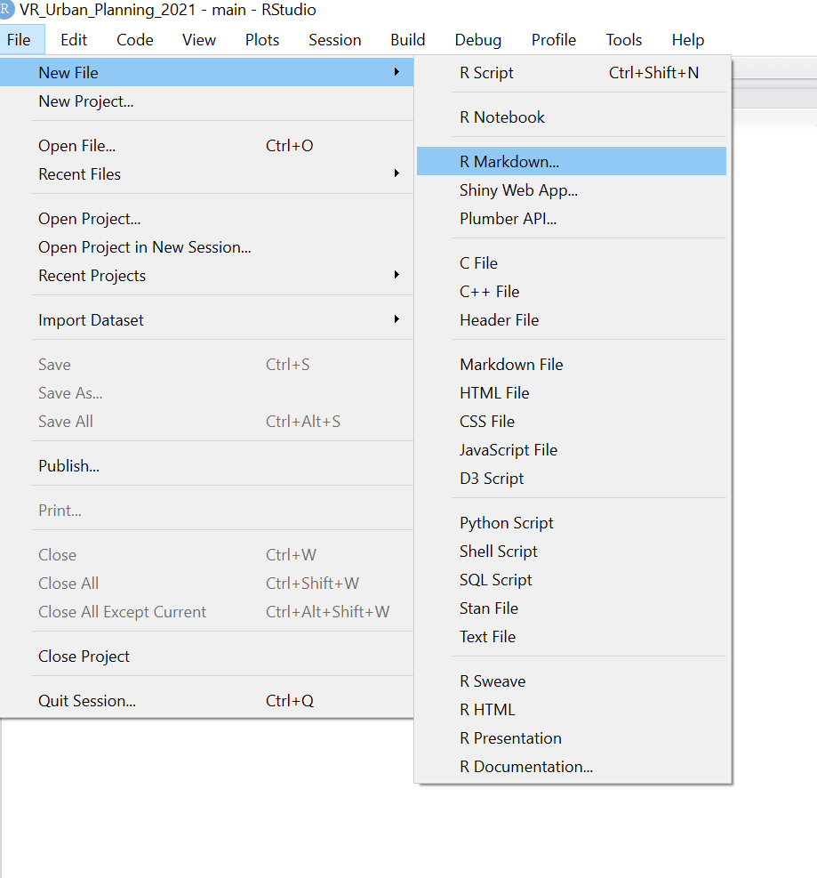
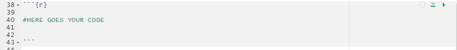
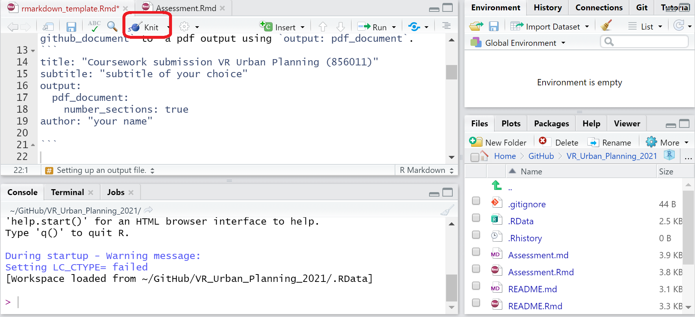

Rmarkdown template
================

This is a R Markdown (.Rmd) file that will allow you to produce a pdf
document that you will need to submit as a part of your assessment. Use
the steps described below to start with your .Rmd file.

## Step 0: Install and load all the necessary packages

The example of how to install and load the packages - for demonstration
only. The \# in front of the line stops the code from executing.

``` r
#install.packages("rmarkdown")
#install.packages("knitr")

#library(rmarkdown)
#library(knitr)
```

## Step 1: Open a new .Rmd file




Here you can choose the output file (as PDF) but this can be changed
later (see the next section).

## Step 2: Setting up the output file

It is recommended to start your Rmarkdown document with the following
inputs to ensure that a pdf document is produced. You can set the output
by changing from github document `output: github_document` to a pdf
output using `output: pdf_document`.

    title: "Coursework submission VR Urban Planning (856011)"
    subtitle: "subtitle of your choice"
    output:
      pdf_document:
        number_sections: true
    author: "your name"

## Step 3: Including Code

To include an R code chunk that will be executable use:


You can read more on executable R chunks
[here](https://www.earthdatascience.org/courses/earth-analytics/document-your-science/rmarkdown-code-chunks-comments-knitr/).
For example, the following code in the executable chunk will allow you
to get a summary of dataset called ‘cars’.

``` r
summary(cars) # here is the code that your use
```

    ##      speed           dist       
    ##  Min.   : 4.0   Min.   :  2.00  
    ##  1st Qu.:12.0   1st Qu.: 26.00  
    ##  Median :15.0   Median : 36.00  
    ##  Mean   :15.4   Mean   : 42.98  
    ##  3rd Qu.:19.0   3rd Qu.: 56.00  
    ##  Max.   :25.0   Max.   :120.00

## Step 4: Including Plots

It is also possible to include visualisations and plots using R code
chunks by simply running a `plot()` function inside the R chunk. For
example, in the code below the dataset ‘pressure’ is plotted in the
figure.

``` r
plot(pressure)
```


## Step 5: Knitting your document

When you open R markdown file in RStudio and click the **Knit** button
(marked in red in the figure below) all R code chunks are run and a pdf
document with your report will be produced. To make sure that the
document is reproducible, you should include a code chunk that shows
which packages you used.



# Report

What follows is an example template of your report.

# Part 1 - Theoretical

## Introduction

This section may contain research questions, motivation of the study,
identified research gaps and the discussion of the advantages and
potential disadvantages of VR use relative to traditional research
approaches *in the chosen case*.

## Hypotheses

List of the hypotheses to be tested and rationale.

## Experimental setup

Detailed description of how the data will be collected.

## Methodology

Description of the methods you will use including justification why
certain method was chosen over other options.

## Planned analysis

Description of the steps that will be undertaken to pre-process, clean
and analyse the data.

## Expected outcomes of the case study

What results are you expecting to achieve?

# Part 2 - Practical

In this part provide the description and code of all steps that were
undertaken to pre-process, clean, analyse and visualise your data
(collected during the lab day), following what you have learned during
practicals.

## References
